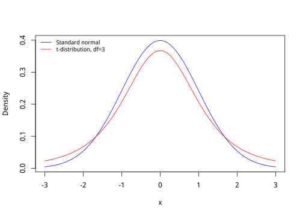
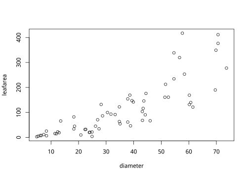
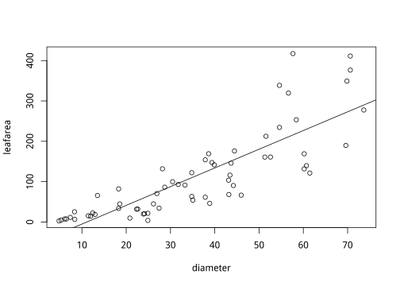
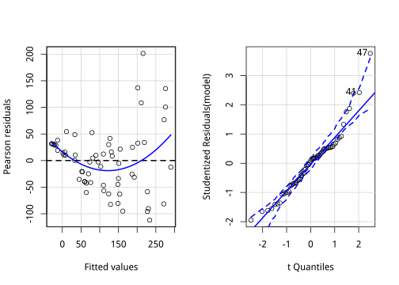
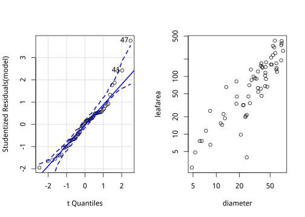
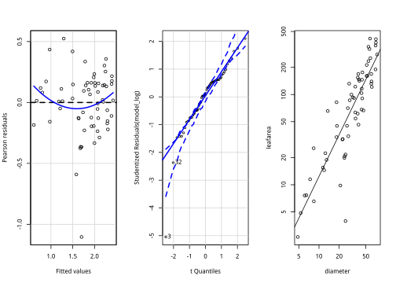

# Basic statistics {#basic}


This book is not an *Introduction to statistics*. There are many books focused on *statistics*, with or without example R code. The focus throughout this book is on the R code itself, as we try to present clear and short solutions to common analysis tasks. In the following, we assume you have a basic understanding of linear regression, Student's $t$-tests, ANOVA, and confidence intervals for the mean.


## Probability distributions {#distributions}

You will have encountered a number of probability distributions before. For example, the *Binomial* distribution is a model for the distribution of the number of *successes* in a sequence of independent trials, for example, the number of heads in a coin tossing experiment. Another commonly used discrete distribution is the *Poisson*, which is a useful model for many kinds of count data. Of course, the most important distribution of all is the *Normal* or Gaussian distribution.

R provides sets of functions to find densities, cumulative probabilities, quantiles, and to draw random numbers from many important distributions. The names of the functions all consist of a one letter prefix that specifies the type of function and a stem which specifies the distribution. Look at the examples in the table below.

**Prefix**


Prefix   Meaning                
-------  -----------------------
`d`      density                
`p`      cumulative probability 
`q`      quantile               
`r`      simulate               

**Suffix**


Suffix    Meaning     
--------  ------------
`binom`   Binomial    
`pois`    Poisson     
`norm`    Normal      
`t`       Student's t 
`chisq`   Chi-squared 
`f`       F           

Using the prefix and the suffix, we can construct each desired function. For example, 


```r
# Calculate the probability of 3 heads out of 10 tosses of a fair coin.
# This is a (d)ensity of a (binom)ial distribution.
dbinom(3, 10, 0.5)
```

```
## [1] 0.1171875
```

```r
# Calculate the probability that a normal random variable (with 
# mean of 3 and standard deviation of 2) is less than or equal to 4.
# This is a cumulative (p)robability of a (norm)al variable.
pnorm(4, 3, 2)
```

```
## [1] 0.6914625
```

```r
# Find the t-value that corresponds to a 2.5% right-hand tail probability
# with 5 degrees of freedom.
# This is a (q)uantile of a (t)distribution.
qt(0.975, 5)
```

```
## [1] 2.570582
```

```r
# Simulate 5 Poisson random variables with a mean of 3. 
# This is a set of (r)andom numbers from a (pois)son distribution.
rpois(5, 3)
```

```
## [1] 0 3 1 2 4
```

See the help page `?Distributions` for more details.

To make a quick plot of a distribution, we can use the density function in combination with `curve`. The following code makes Fig. \@ref(fig:distplot).


```r
# A standard normal distribution
curve(dnorm(x, sd=1, mean=0), from=-3, to=3,
      ylab="Density", col="blue")

# Add a t-distribution with 3 degrees of freedom.
curve(dt(x, df=3), from =-3, to=3, add=TRUE, col="red")

# Add a legend (with a few options, see ?legend)
legend("topleft", c("Standard normal","t-distribution, df=3"), lty=1, col=c("blue","red"),
       bty='n', cex=0.8)
```

<div class="figure">

<p class="caption">(\#fig:distplot)Two univariate distributions plotted with curve()</p>
</div>

\BeginKnitrBlock{rmdtry}<div class="rmdtry">Make a histogram (recall Section \@ref(hist) of a sample of random numbers from a distribution of your choice.</div>\EndKnitrBlock{rmdtry}


## Descriptive Statistics {#descstat}

Descriptive statistics summarise some of the properties of a given data set. Generally, we are interested in measures of location (central tendency, such as mean and median) and scale (variance or standard deviation). Other descriptions can include the sample size, the range, and so on. We already encountered a number of functions that can be used to summarize a vector. 

Let's look at some examples for the Pupae dataset.
  

```r
# Read data
data(pupae)

# Extract the weights (for convenience)
weight <- pupae$PupalWeight

# Find the number of observations
length(weight)
```

```
## [1] 84
```

```r
# Find the average (mean) weight
mean(weight)
```

```
## [1] 0.3110238
```

```r
# Find the Variance
var(weight)
```

```
## [1] 0.004113951
```

Note that R will compute the sample variance (not the population variance). The standard deviation can be calculated as the square root of the variance, or use the `sd` function directly.


```r
# Standard Deviation
sqrt(var(weight))
```

```
## [1] 0.06414009
```

```r
# Standard Deviation
sd(weight)
```

```
## [1] 0.06414009
```

Robust measures of the location and scale are the median and inter-quartile range; R has functions for these.


```r
# median and inter-quartile range
median(weight)
```

```
## [1] 0.2975
```

```r
IQR(weight)
```

```
## [1] 0.09975
```

The median is the 50th percentile or the second quartile. The `quantile` function can compute quartiles as well as arbitrary percentiles/quantiles.


```r
# Default: computes quartiles.
quantile(weight)
```

```
##      0%     25%     50%     75%    100% 
## 0.17200 0.25625 0.29750 0.35600 0.47300
```

```r
# Or set any quantiles
quantile(weight, probs=seq(0,1,0.1))
```

```
##     0%    10%    20%    30%    40%    50%    60%    70%    80%    90% 
## 0.1720 0.2398 0.2490 0.2674 0.2892 0.2975 0.3230 0.3493 0.3710 0.3910 
##   100% 
## 0.4730
```

**Missing Values**: All of the above functions will return `NA` if the data contains *any* missing values. However, they also provide an option to remove missing values (`NA`s) before their computations (see also Section \@ref(workingmissing)).


```r
mean(pupae$Frass)
```

```
## [1] NA
```

```r
mean(pupae$Frass, na.rm=TRUE)
```

```
## [1] 1.846446
```

The `summary` function provides a lot of the above information in a single command:

```r
summary(weight)
```

```
##    Min. 1st Qu.  Median    Mean 3rd Qu.    Max. 
##  0.1720  0.2562  0.2975  0.3110  0.3560  0.4730
```

The `moments` package provides 'higher moments' if required, for example, 
the `skewness` and `kurtosis`.

```r
# load the moments package
library(moments)
skewness(weight)
```

```
## [1] 0.3851656
```

```r
kurtosis(weight)
```

```
## [1] 2.579144
```

The `pastecs` package includes a useful function that calculates many descriptive statistics for numeric vectors, including the standard error for the mean (for which R has no built-in function).


```r
library(pastecs)

# see ?stat.desc for description of the abbreviations
stat.desc(weight)
```

```
##      nbr.val     nbr.null       nbr.na          min          max 
## 84.000000000  0.000000000  0.000000000  0.172000000  0.473000000 
##        range          sum       median         mean      SE.mean 
##  0.301000000 26.126000000  0.297500000  0.311023810  0.006998258 
## CI.mean.0.95          var      std.dev     coef.var 
##  0.013919253  0.004113951  0.064140091  0.206222446
```

```r
# conveniently, the output is a character vector which we can index by name,
# for example extracting the standard error for the mean
stat.desc(weight)["SE.mean"]
```

```
##     SE.mean 
## 0.006998258
```


Sometimes you may wish to calculate descriptive statistics for subgroups in the data. We will come back to this extensively in Section \@ref(tapplyaggregate) and later sections.


## Inference for a single population {#inference}

*Inference* is answering questions about population parameters based on a sample. The mean of a random sample from a population is an estimate of the population mean. Since it is a single number it is called a point estimate. It is often desirable to estimate a range within which the population parameter lies with high probability. This is called a confidence interval.

One way to get confidence intervals in R is to use the quantile functions for the relevant distribution. Remember from your introductory statistics course that a $100(1-\alpha)$\% confidence interval for the mean on normal population is given by,

\[\bar{x} \pm t_{\alpha/2, n-1} \frac{s}{\sqrt{n}}\]

where $\bar{x}$ is the sample mean, $s$ the sample standard deviation and $n$ is the sample size. $t_{\alpha/2, n-1}$ is the $\alpha/2$ tail point of a $t$-distribution on $n-1$ degrees of freedom. That is, if $T$ has a $t$-distribution on $n-1$ degrees of freedom.

\[P(T \leq t_{\alpha/2, n-1}) = 1-\alpha/2 \]

The R code for this confidence interval can be written as,


```r
alpha <- 0.05 # for a 95% confidence interval
xbar <- mean(weight)
s <- sd(weight)
n <- length(weight)
half.width <- qt(1-alpha/2, n-1)*s/sqrt(n)

# Confidence Interval 
c(xbar - half.width, xbar + half.width)
```

```
## [1] 0.2971046 0.3249431
```

Here, we assumed a normal distribution for the population. You may have been taught that if $n$ is *large*, say $n>30$, then you can use a normal approximation. That is, replace `qt(1-alpha/2, n-1)` with `qnorm(1-alpha/2)`, but there is no need, R can use the $t$-distribution for any $n$ (and the results will be the same, as the $t$-distribution converges to a normal distribution when the df is large).


### Hypothesis testing

There may be a reason to ask whether a dataset is consistent with a certain mean. For example, are the pupae weights consistent with a population mean of 0.29? For normal populations, we can use Student's $t$-test, available in R as the `t.test` function. Let's test the null hypothesis that the population mean is 0.29:


```r
t.test(weight, mu=0.29)
```

```
## 
## 	One Sample t-test
## 
## data:  weight
## t = 3.0041, df = 83, p-value = 0.00352
## alternative hypothesis: true mean is not equal to 0.29
## 95 percent confidence interval:
##  0.2971046 0.3249431
## sample estimates:
## mean of x 
## 0.3110238
```

Note that we get the $t$-statistic, degrees of freedom ($n-1$) and a p-value for the test, with the specified alternative hypothesis (not equal, i.e. two-sided). In addition, `t.test` gives us a 95% confidence interval (compare to the above), and the estimated mean, $\bar{x}$.

We can use `t.test` to get any confidence interval, and/or to do one-sided tests,


```r
t.test(weight, mu=0.29, alternative="greater", conf.level=0.90)
```

```
## 
## 	One Sample t-test
## 
## data:  weight
## t = 3.0041, df = 83, p-value = 0.00176
## alternative hypothesis: true mean is greater than 0.29
## 90 percent confidence interval:
##  0.3019832       Inf
## sample estimates:
## mean of x 
## 0.3110238
```

Note that the confidence interval is one-sided when the test is one-sided.

The `t.test` is appropriate for data that is approximately normally distributed. You can check this using a histogram or a QQ-plot (see Sections~\ref{sec:hist} and~\ref{sec:diagplots}). If the data is not very close to a normal distribution then the `t.test` is often still appropriate, as long as the sample is large.

If the data is not normal and the sample size is small, there are a couple of alternatives: transform the data (often a log transform is enough) or use a *nonparametric* test, in this case the Wilcoxon signed rank test. We can use the `wilcox.test` function for the latter, its interface is similar to `t.test` and it tests the hypothesis that the data is symmetric about the hypothesized population mean. For example,


```r
wilcox.test(weight, mu=0.29)
```

```
## 
## 	Wilcoxon signed rank test with continuity correction
## 
## data:  weight
## V = 2316.5, p-value = 0.009279
## alternative hypothesis: true location is not equal to 0.29
```

```r
# Likewise: (result not shown)
#wilcox.test(weight, mu=0.29, alternative="greater")
```

#### Test for proportions

Sometimes you want to test whether observed proportions are consistent with a hypothesized population proportion. For example, consider a coin tossing experiment where you want to test the hypothesis that you have a fair coin (one with an equal probability of landing heads or tails). In your experiment, you get  60 heads out of 100 coin tosses. Do you have a fair coin? We can use the `prop.test` function:


```r
# 60 'successes' out of a 100 trials, the hypothesized probability is 0.5.
prop.test(x=60, n=100, p=0.5)
```

```
## 
## 	1-sample proportions test with continuity correction
## 
## data:  60 out of 100, null probability 0.5
## X-squared = 3.61, df = 1, p-value = 0.05743
## alternative hypothesis: true p is not equal to 0.5
## 95 percent confidence interval:
##  0.4970036 0.6952199
## sample estimates:
##   p 
## 0.6
```

```r
# Same as above, but for a one-sided test.
prop.test(60, 100, p=0.5, alternative="greater")
```

```
## 
## 	1-sample proportions test with continuity correction
## 
## data:  60 out of 100, null probability 0.5
## X-squared = 3.61, df = 1, p-value = 0.02872
## alternative hypothesis: true p is greater than 0.5
## 95 percent confidence interval:
##  0.5127842 1.0000000
## sample estimates:
##   p 
## 0.6
```


## Inference for two populations

Commonly, we wish to compare two (or more) populations. For example, the `pupae` dataset has pupal weights for female and male pupae. We may wish to compare the weights of males (`gender=0`) and females (`gender=1`). 

There are two ways to use `t.test` to compare the pupal weights of males and females. In the first method, we make two vectors, 


```r
weight <- pupae$PupalWeight
gender <- pupae$Gender
weight.male <- weight[gender==0]
weight.female <- weight[gender==1]

# We will assume equal variance for male and female pupae (see Unequal variances, below):
t.test(weight.male, weight.female, var.equal=TRUE)
```

```
## 
## 	Two Sample t-test
## 
## data:  weight.male and weight.female
## t = -7.3571, df = 76, p-value = 1.854e-10
## alternative hypothesis: true difference in means is not equal to 0
## 95 percent confidence interval:
##  -0.10012896 -0.05746573
## sample estimates:
## mean of x mean of y 
## 0.2724884 0.3512857
```

\BeginKnitrBlock{rmdtry}<div class="rmdtry">Confirm that there are missing data in both variables in the example above. The default action is to omit all missing values (see description under `na.action` in the help file `?t.test`).</div>\EndKnitrBlock{rmdtry}

There is also a *formula* interface for `t.test`. The formula interface is important because we will use it in many other functions, like linear regression and linear modelling. For the `t.test` we can use the formula interface on the extracted variables, or without extracting the variables.


```r
# Using the vectors we constructed in the previous example
t.test(weight ~ gender,  var.equal=TRUE)
```

```
## 
## 	Two Sample t-test
## 
## data:  weight by gender
## t = -7.3571, df = 76, p-value = 1.854e-10
## alternative hypothesis: true difference in means is not equal to 0
## 95 percent confidence interval:
##  -0.10012896 -0.05746573
## sample estimates:
## mean in group 0 mean in group 1 
##       0.2724884       0.3512857
```

```r
# Or by specifying the data= argument. (same result not shown)
# t.test(PupalWeight~Gender,  data=pupae, var.equal=TRUE)
```


### Paired data

The `t.test` can also be used when the data are paired, for example, measurements taken before and after some treatment on the same subjects. The `pulse` dataset is an example of paired data (see Section~\ref{sec:pulsedata}). We will compare pulse rates before and after exercise, including only those subjects that exercised (`Ran=1`),


```r
data(pulse)
pulse.before <- with(pulse, Pulse1[Ran==1])
pulse.after <- with(pulse, Pulse2[Ran==1])
t.test(pulse.after, pulse.before, paired=TRUE)
```

```
## 
## 	Paired t-test
## 
## data:  pulse.after and pulse.before
## t = 16.527, df = 45, p-value < 2.2e-16
## alternative hypothesis: true difference in means is not equal to 0
## 95 percent confidence interval:
##  45.12843 57.65418
## sample estimates:
## mean of the differences 
##                 51.3913
```

### Unequal variances

The default for the two-sample `t.test` is actually to *not* assume equal variances. The theory for this kind of test is quite complex, and the resulting $t$-test is now only approximate, with an adjustment called the 'Satterthwaite' or 'Welch' approximation made to the degrees of freedom.

Since this modified $t$-test makes fewer assumptions, you could ask why we ever use the equal variances form. If the assumption is reasonable, then this (equal variances) form will have more power, i.e. will reject the null hypothesis more often when it is actually false.

### Assumed normality

The two-sample $t$-test assumes normality of the data (which you can check using a histogram or a QQ-plot) or that the sample sizes are large enough that the *central limit theorem* applies. Note that the paired $t$-test assumes only that the differences are normal - the data themselves can still follow any number of distributions. The `wilcox.test` can be used when any of these assumptions are suspect. In the case of two samples (unpaired), this test used is called the Wilcoxon rank sum test (also known as the Mann-Whitney test).


```r
wilcox.test(PupalWeight ~ Gender,  data=pupae, exact=FALSE)
```

```
## 
## 	Wilcoxon rank sum test with continuity correction
## 
## data:  PupalWeight by Gender
## W = 152.5, p-value = 1.704e-09
## alternative hypothesis: true location shift is not equal to 0
```

### Power {#power}

When testing a hypothesis, remember that there are two types of possible errors, due to the random nature of sampling data. These are the "Type 1 error" (rejecting the null hypothesis when it is actually true), and the "Type 2 error" (failing to reject the null when it is actually false). The probability of a Type 1 error is controlled by $\alpha$, the threshold on the $p$-value. The $p$-value is the probability of observing the test statistic, if the null hypothesis is actually true. So by keeping $\alpha$ small (for some reason, 0.05 is most commonly used), we control the chance of a Type 1 error. 

Statistical power is defined as 1 - the probability of a Type 2 error. Or in other words, the probability that we reject the null hypothesis when it is actually false. Consider the situation where we compare the means of two samples. It is easy to see that our power depends not only on $\alpha$, but also on the actual difference in means of the populations that the samples were drawn from. If they are very different, it will be easier to find a significant difference. So, to calculate the power we must specify how different the means are under the alternative hypothesis.

For a $t$-test, we can use the `power.t.test` function to calculate the power. To approximate the power for the pupal weight t-test (as we saw in the previous section), we can use the following,


```r
power.t.test(n=35, delta=0.08, sd=0.05, sig.level=0.05)
```

```
## 
##      Two-sample t test power calculation 
## 
##               n = 35
##           delta = 0.08
##              sd = 0.05
##       sig.level = 0.05
##           power = 0.9999982
##     alternative = two.sided
## 
## NOTE: n is number in *each* group
```

Here we have assumed equal groups of size 35 for each gender (although this is not exactly correct), a true difference in mean weights of 0.08, and a standard deviation of 0.05. The power is over 99\%, meaning that, with these conditions, we will be able to reject the null hypothesis 99\% of the time.

We can also calculate the required sample size, if we wish to attain a certain power. For example, suppose we want to detect a difference of 0.02 with 75% power. What sample size do we need?


```r
power.t.test(delta=0.02, sd=0.05, sig.level=0.05, power=0.75)
```

```
## 
##      Two-sample t test power calculation 
## 
##               n = 87.7248
##           delta = 0.02
##              sd = 0.05
##       sig.level = 0.05
##           power = 0.75
##     alternative = two.sided
## 
## NOTE: n is number in *each* group
```

We would need 88 observations for each gender.

\BeginKnitrBlock{rmdtry}<div class="rmdtry">Using `power.t.test` as in the examples above, see what happens when you set $\alpha$ (`sig.level`) to 0.01 or 0.1. Decide for yourself if the result makes sense.</div>\EndKnitrBlock{rmdtry}


## Simple linear regression {#simpleregression}

To fit linear models of varying complexity, we can use the `lm` function. In Chapter \@ref(linmodel) we will meet various more complex linear models, but here we just focus on simple relationships between two continuous variables. The simplest model is a straight-line relationship between an *x* and a *y* variable. In this situation, the assumption is that the *y*-variable (the response) is a linear function of the *x*-variable (the predictor, or independent variable), plus some random noise or measurement error. For the simplest case, both *x* and *y* are assumed to be continuous variables. In statistical notation we write this as,

$$
y = \alpha+\beta x +\varepsilon {#eqn:simplelin}
$$

Here $\alpha$ and $\beta$ are (population) parameters that need to be estimated from the data. The error ($\epsilon$) is assumed to follow a normal distribution with a mean of zero, and a standard deviation of $\sigma$. It is also assumed that $\sigma$ is constant and does not depend on *x*.

Let's look at an example using the allometry data (see Fig. \@ref(fig:allomquickplot)),


```r
# Read data
data(allometry)
plot(leafarea~diameter, data=allometry)
```

<div class="figure">

<p class="caption">(\#fig:allomquickplot)Quick inspection of the allometry data, before we perform a linear regression.</p>
</div>

We can see from this plot that leaf area generally increases with tree diameter. So we can use `lm`
to estimate the parameters in equation~\ref{eqn:simplelin}, or in other words to 'fit the model'.


```r
# Fit linear regression of 'leafarea' on 'diameter',
# Results are stored in an object called model
model <- lm(leafarea~diameter, data=allometry)

# Print a summary of the regression:
summary(model)
```

```
## 
## Call:
## lm(formula = leafarea ~ diameter, data = allometry)
## 
## Residuals:
##      Min       1Q   Median       3Q      Max 
## -112.057  -40.519    4.699   30.344  201.377 
## 
## Coefficients:
##             Estimate Std. Error t value Pr(>|t|)    
## (Intercept) -51.3245    15.9746  -3.213   0.0021 ** 
## diameter      4.6333     0.3955  11.716   <2e-16 ***
## ---
## Signif. codes:  0 '***' 0.001 '**' 0.01 '*' 0.05 '.' 0.1 ' ' 1
## 
## Residual standard error: 60.16 on 61 degrees of freedom
## Multiple R-squared:  0.6923,	Adjusted R-squared:  0.6873 
## F-statistic: 137.3 on 1 and 61 DF,  p-value: < 2.2e-16
```

```r
# Or just the coefficients (intercept and slope):
coef(model)
```

```
## (Intercept)    diameter 
##  -51.324479    4.633321
```

As you can see, `lm` uses the formula interface that we discussed earlier (it always has the form y ~ x). 

The `summary` function prints a lot of information about the fit. In this case, it shows that the intercept is -51.324, which is the predicted leaf area for a tree with diameter of zero (not very useful in this case). 

It also shows a standard error and a t-statistic for this intercept, along with a p-value which shows that the intercept is significantly different from zero (because the p-value is small). The second line in the coefficients table shows the slope is 4.633, and that this slope is highly significantly different from zero.

In addition, we have a `Residual standard error` of 60.16, which is an estimate of $\sigma$, and an `R-squared` of 0.69 (which is the squared correlation coefficient). Finally, the `F-statistic` says whether the overall fit is significant, which in this case, is the same as the test for $\beta$ (because in this situation, the F-statistic is simply the square of the t-statistic).

### Adding regression lines to a plot

It is straightforward to add the regression line to an existing plot (Fig. \@ref(fig:allomquickplot2)). Simply use `abline` and the `model` object we created previously, if you are using base graphics.


```r
plot(leafarea~diameter, data=allometry)
abline(model)
```

<div class="figure">

<p class="caption">(\#fig:allomquickplot2)The allometry data, with an added regression line.</p>
</div>

With `ggplot2`, we can use the handy shortcut `stat_smooth`, though the disadvantage is that it is a bit harder to control how we fit the model. For simple applications as these, though, it works fine. Results of the following example are not shown.


```r
library(ggplot2)

ggplot(allometry, aes(x = diameter, y = leafarea)) +
  geom_point() +
  stat_smooth(method = "lm")
```


### Diagnostic plots {#diagplots}

There are many ways to examine how well a model fits the data, and this step is important in deciding whether the model is appropriate. Most diagnostics are based on the residuals, the difference between the $\hat{y}=\hat{\alpha}+\hat{\beta} x$ fitted values and the actual data points.

If needed, the fitted values and residuals can be extracted using `fitted(model)` and `residuals(model)` respectively.

The two simplest and most useful diagnostic plots are the scale-location plot and a QQ-plot of the residuals. These can be produced with `plot`, but we much prefer two functions from the `car` package, as shown by the following example (Fig.~\ref{fig:diagnos1}):

```r
model <- lm(leafarea ~ diameter, data=allometry)

library(car)
```

```
## Loading required package: carData
```

```r
residualPlot(model)
qqPlot(model)
```

<div class="figure">

<p class="caption">(\#fig:diagnos1)Two standard diagnostic plots for a fitted lm object.</p>
</div>

```
## [1] 41 47
```

The scale-location plot shows  the square root of the *standardized* residuals against the fitted values. In an ideal situation, there should be no structure in this plot. Any curvature indicates that the model is under- or over-fitting, and a general spread-out (or contracting) from left to right indicates non-constant variance ('heteroscedasticity'). The QQ-plot enables us to check for departures from normality. Ideally, the standardized residuals should lie on a straight line.

Some departure from the straight line is to be expected though, even when the underlying distribution is really normal. The `qqPlot` function from the `car` package enhances the standard QQ-plot, by including a confidence interval (Fig~\ref{fig:qqplotcar}). In this case, there is some evidence of heteroscedasticity, and possibly curvature. 

The following code makes the QQ-plot and a plot of the data on a log-log scale (Fig. \@ref(fig:qqplotcar)).


```r
library(car)
qqPlot(model)
```

```
## [1] 41 47
```

```r
plot(leafarea ~ diameter, data=allometry, log="xy")
```

<div class="figure">

<p class="caption">(\#fig:qqplotcar)A plot of the Allometry data on a log-log scale.</p>
</div>


On a log-log scale, it looks like the variance is much more constant, and the relationship is more linear. So, we go ahead and refit the model to log-transformed variables. 

As we can see in Fig. \@ref(fig:qqplotcar), the diagnostic plots look much better, except for a couple of points at the lower left corner of the QQ-plot. Notice that these outliers have been marked with their row number from the dataframe.

The following code produces Fig. \@ref(fig:diagnos2), including diagnostic plots and a plot of the data with a regression line added. Note that the `abline` function will only work as intended (shown before) on the log-log plot if we use log to the base 10 (`log10`), in the model fit.


```r
model_log <- lm(log10(leafarea)~log10(diameter), data=allometry)
summary(model_log)
```

```
## 
## Call:
## lm(formula = log10(leafarea) ~ log10(diameter), data = allometry)
## 
## Residuals:
##      Min       1Q   Median       3Q      Max 
## -1.10384 -0.14155  0.02161  0.15434  0.52455 
## 
## Coefficients:
##                 Estimate Std. Error t value Pr(>|t|)    
## (Intercept)      -0.4468     0.1600  -2.793  0.00697 ** 
## log10(diameter)   1.5387     0.1070  14.385  < 2e-16 ***
## ---
## Signif. codes:  0 '***' 0.001 '**' 0.01 '*' 0.05 '.' 0.1 ' ' 1
## 
## Residual standard error: 0.2611 on 61 degrees of freedom
## Multiple R-squared:  0.7723,	Adjusted R-squared:  0.7686 
## F-statistic: 206.9 on 1 and 61 DF,  p-value: < 2.2e-16
```

```r
residualPlot(model_log)
qqPlot(model_log)
```

```
## [1]  3 32
```

```r
plot(leafarea~diameter, data=allometry, log="xy")
abline(model_log)
```

<div class="figure">

<p class="caption">(\#fig:diagnos2)Diagnostic plots for the allometry data, refitted on a log-log scale (left panels). The allometry data fitted on a log-log scale, with the regression line (right panel).</p>
</div>


\BeginKnitrBlock{rmdtry}<div class="rmdtry">The residuals of a linear model fit can be extracted with the `residuals` function. For one of the linear models from the above examples, extract the residuals, and make a histogram to help inspect normality of the residuals.</div>\EndKnitrBlock{rmdtry}


